# Machine Learning in the Cloud

A How-to guide from data fetching to model deployment and everything in between.

<br>

## TOC:

1. Goals of this Blog Post
2. Prerequisites
3. The Machine Learning Cycle
4. Exploratory Data Analysis
5. Local Setup
8. Creating a preprocessing pipeline
6. Creating a Pneumonia detector from chest x-rays
7. Production deployment
9. CI / CD with GitHub Actions
10. Things to Improve

<br>
<br>

## Goals of this blog post

My goal is to demystify machine learning in the cloud. The concept of a "Cloud" by itself can already be difficult to understand, and machine learning in the cloud is again a bit harder. With this blog post, I want to give you a hands-on experience and a detailed overview of machine learning in the cloud. You will learn:

- Why it is useful and why you should know it
- How to set up the necessary infrastructure
- How to use CPUs for your pipelines and GPUs for your model training
- How to set up a flask-server and deploy your model
- How to create a CI / CD pipeline with GitHub Actions to completely automate the process

The whole project is open source, you can find it here: [https://github.com/SaschaMet/E2E_ML_Scaleway](https://github.com/SaschaMet/E2E_ML_Scaleway)

<br>
<br>

## Prerequisites

We will use Scaleway as our cloud service provider. Not only is Scaleway easy to set up, it is also very cheap. CPU instances start at 0.0025 € / hour, and a GPU instance only costs 1 € / hour. But even if you do not want to use Scaleway, you can learn from this guide and apply it to every other vendor like AWS, GCP, or Linode.

To follow this guide, you have to have a Scaleway account and your Scaleway CLI ready. Here are some links which show you how to do it:

- [https://console.scaleway.com/register](https://console.scaleway.com/register)
- [https://www.scaleway.com/en/docs/manage-cloud-servers-with-scaleway-cli/](https://www.scaleway.com/en/docs/manage-cloud-servers-with-scaleway-cli/)
- [https://www.scaleway.com/en/docs/configure-new-ssh-key/](https://www.scaleway.com/en/docs/configure-new-ssh-key/)

If you want to use a GPU, you have to open a support ticket because GPUs are not available after creating a new account. The process takes approx. 24 hours. This step however is entirely optional. You can follow this guide even without a GPU.

**An important note:** When you follow this guide, you will have to pay for your used resources. Luckily Scaleway is very cheap, but you should expect to pay up to 5 €.

We will use the [NIH Chest x-ray Dataset](https://www.notion.so/Blog-Post-d34e95cea0844332abb8f8d76b40f788) and build a model to detect Pneumonia in an x-ray image. The whole dataset consists of 112,120 x-ray images with disease labels from 30,805 unique patients and has a size of 42 GB. Because it would take a tone of time to down- and upload this dataset, I will only use a subset of ~ 1,400 images. That is enough to train a model, but if you want to, you can work with the whole dataset as well.

<br>
<br>

## The Machine Learning Cycle

**What is the Machine Learning Cycle?**

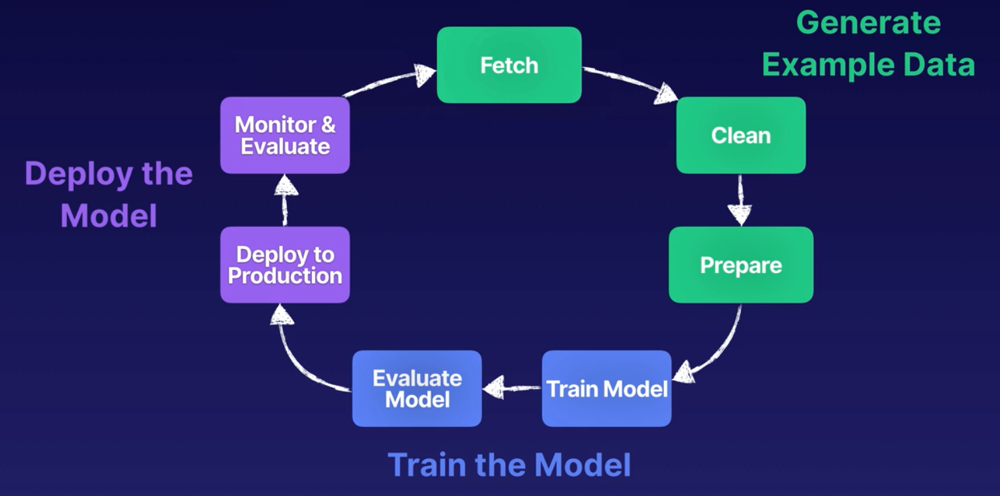

*The Machine Learning Cycle - Source: [https://acloudguru.com](https://acloudguru.com/)*

The ML Cycle is a series of steps from fetching your data, cleaning and preparing it, model training and evaluation, and finally, production deployment and monitoring and evaluation. It gives you a good overview of what you have to do to develop, train, and deploy your model to production.

<br>

**Who should use the cloud for machine learning projects?**

You do not need a cloud provider to build a machine learning solution. After all, there are plenty of open-source machine learning frameworks that can run on local hardware. But if you want to develop sophisticated models in-house, you will likely run into scaling issues because training models on real-world data typically require large compute clusters.

A cloud provider lets you quickly scale your computing power. You can, for example, train your model on hundred GPUs at the same time. And the good thing is you don't have to buy them upfront. Most providers offer a pay-per-use model, so you only pay for the resources you use.

The cloud also makes it easy for enterprises to experiment with machine learning capabilities and scale up as projects go into production and demand for those features increases. Also, AWS, Microsoft Azure, and Google Cloud Platform offer many machine learning options that don't require in-depth knowledge of AI, machine learning theory, or a team of data scientists. They even advertise with [Machine Learning per Drag & Drop](https://techcrunch.com/2019/05/02/microsoft-launches-a-drag-and-drop-machine-learning-tool-and-hosted-jupyter-notebooks/).

<br>

**Why should you learn how to do machine learning in the cloud?**

A survey by Tech Pro Research found that just 28% of companies have some experience with AI or machine learning, and 42% said their enterprise IT personnel don’t have the skills required to implement and support AI and machine learning. So these skills are rare and in high demand. Having those skills in your skillset is, therefore, huge if you want to advance your career in machine learning.

<br>
<br>

## Exploratory Data Analysis

Understanding your data is an absolute must in every data science project. So let's have a look at our dataset:

- The NIH Chest x-ray Dataset consists of 112,120 x-ray images with disease labels from 30,805 unique patients
- The authors used Natural Language Processing to create these labels to text-mine disease classifications from the associated radiological reports. The labels are expected to be >90% accurate
- Chest x-rays are one of the most frequent and cost-effective medical imaging examinations available. However, clinical diagnosis of a chest x-ray can be challenging
- There are 15 classes (14 diseases and one for "No findings") in the dataset. Images can be classified as "No findings" or one or more disease classes:
    - Atelectasis
    - Consolidation
    - Infiltration
    - Pneumothorax
    - Edema
    - Emphysema
    - Fibrosis
    - Effusion
    - Pneumonia
    - Pleural_thickening
    - Cardiomegaly
    - Nodule Mass
    - Hernia

<br>
Because the whole dataset is 42GB big, and creating a perfect model is not the scope of this post, we only work with a subset of the dataset. In our case, we will use only 1,402 scans.
<br>
<br>

After some cleaning, we have the following columns in our dataset:

- Image_Index: String
- Follow-up_#: Integer
- Patient_ID: Integer
- Patient_Age: Integer
- Patient_Gender: String
- No Finding: Integer
- Atelectasis: Integer
- Consolidation: Integer
- Infiltration: Integer
- Pneumothorax: Integer
- Edema: Integer
- Emphysema: Integer
- Fibrosis: Integer
- Effusion: Integer
- Pneumonia: Integer
- Pleural_thickening: Integer
- Cardiomegaly: Integer
- Nodule Mass: Integer
- Hernia: Integer

<br>

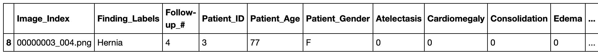
*Extract of our dataframe*

<br>
Now let's look at the data:
<br>
<br>

**Gender distribution**

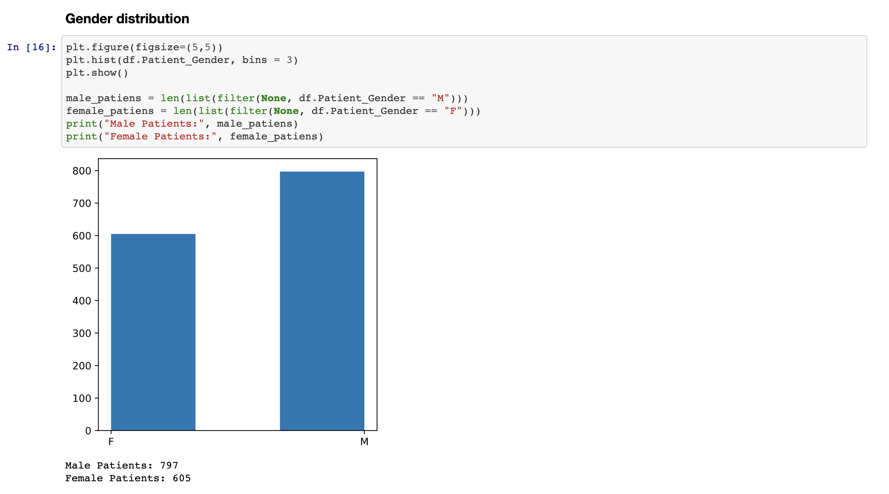

*Gender distribution*

We have 797 male and 605 female patients.

<br>

**Age distribution**

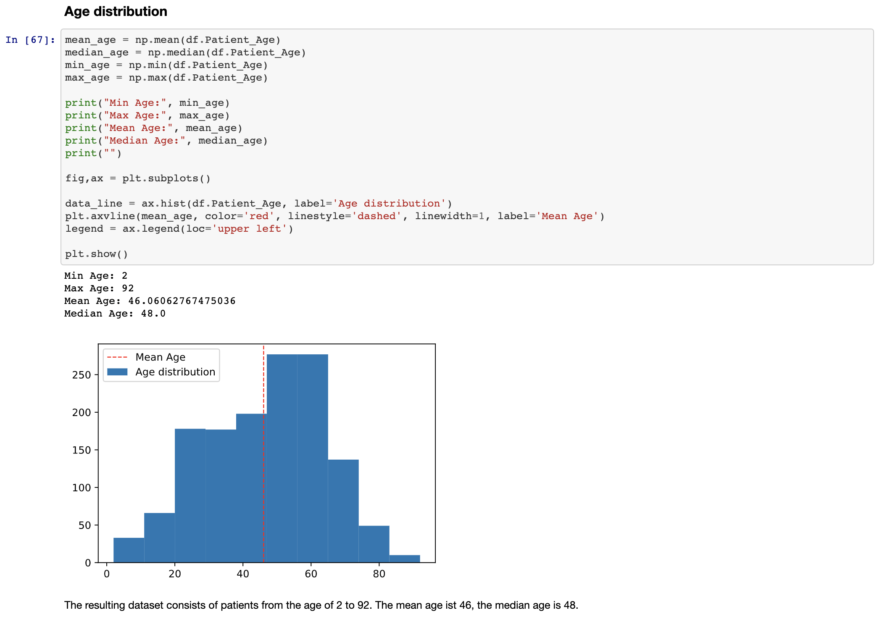

The ages range from two to 92 with a mean age of 46.

<br>

**Case distribution**

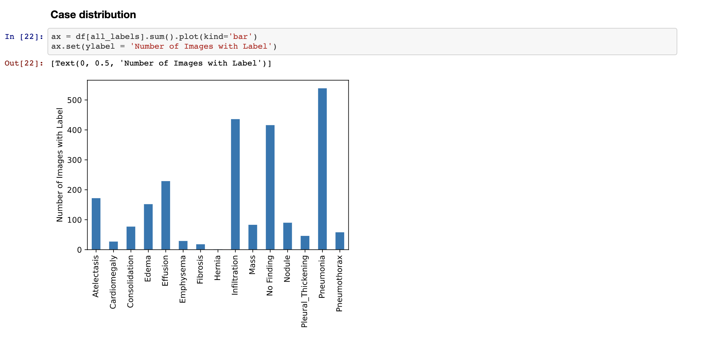

The most common value, besides Pneumonia, is "No finding." The most common disease after Pneumonia is Infiltration.

<br>

Finally, let's look at some x-rays. I have plotted the images together with a standardized distribution of the pixel intensity.

**Images with Pneumonia**

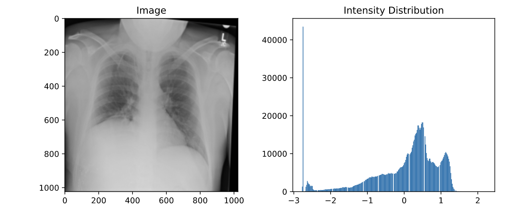

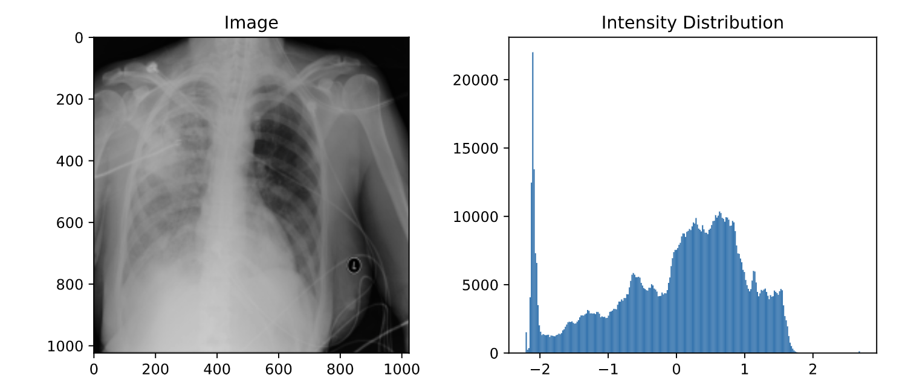

<br>

**Images without Pneumonia**

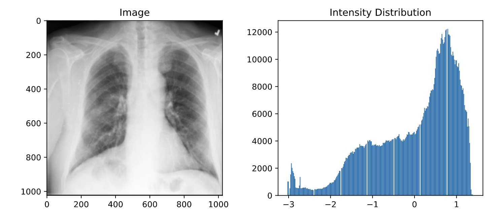

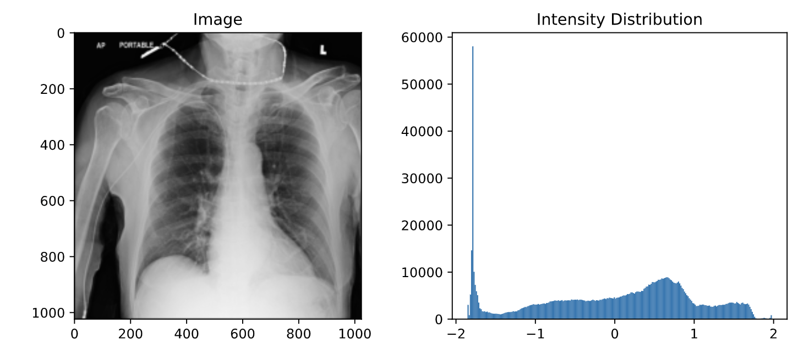

As you can see, Pneumonia and non-Pneumonia patients' intensity distributions follow more of a normal distribution. As already mentioned above, the diagnosis of Pneumonia from chest x-rays can be challenging. This has several reasons:

1. The appearance of Pneumonia in a chest x-ray can be very vague depending on the stage of the infection
2. Pneumonia often overlaps with other diseases
3. Pneumonia can mimic benign abnormalities

For more information and to download the complete dataset, visit the [Kaggle Page](https://www.kaggle.com/nih-chest-xrays/data). You can find the complete EDA here: [https://github.com/SaschaMet/E2E_ML_Scaleway/blob/main/eda/exploratory_data_analysis.ipynb](https://github.com/SaschaMet/E2E_ML_Scaleway/blob/main/eda/exploratory_data_analysis.ipynb)

Now that we have done our EDA let's dive into the real project.

<br>
<br>

## Local Setup

To get started, download the sample repository:

```bash
git clone https://github.com/SaschaMet/E2E_ML_Scaleway.git
```

and our dataset from here:  [https://scw-ml-example.s3.fr-par.scw.cloud/Archive.zip](https://scw-ml-example.s3.fr-par.scw.cloud/Archive.zip)

<br>

If you want to play with the code locally, you have to do three more steps:

1. Open the repository and make a new directory called "data."

```bash
mkdir data
```

2. Open the zip-File and move the images Folder with our x-ray images into the data directory.

3. Install the dependencies

```bash
pip install -r requirements.txt
```

Now you are ready and you can use the project on your local computer.

But our real goal is to move the project to the cloud. So when you're ready, let's move on and create our preprocessing pipeline.

<br>
<br>

## Creating a preprocessing pipeline

For our preprocessing pipeline, we need a few things:

- A place to store the data
- The x-ray images
- Metadata about the photos (Patient Data, Ground Truth Data)
- A python file with the code of our pipeline
- A server to run our code on

<br>

**Creating a Data Storage**

We need a place to store our images, our trained model to deploy and many other things. The easiest way to create such data storage is through the Scaleway console. After logging in to your account, go to "Data Storage" and create a new bucket. It is best to make it in the Paris Region because Scaleway only offers GPUs in this region, and the data transfer is faster when the data is stored in the same place.

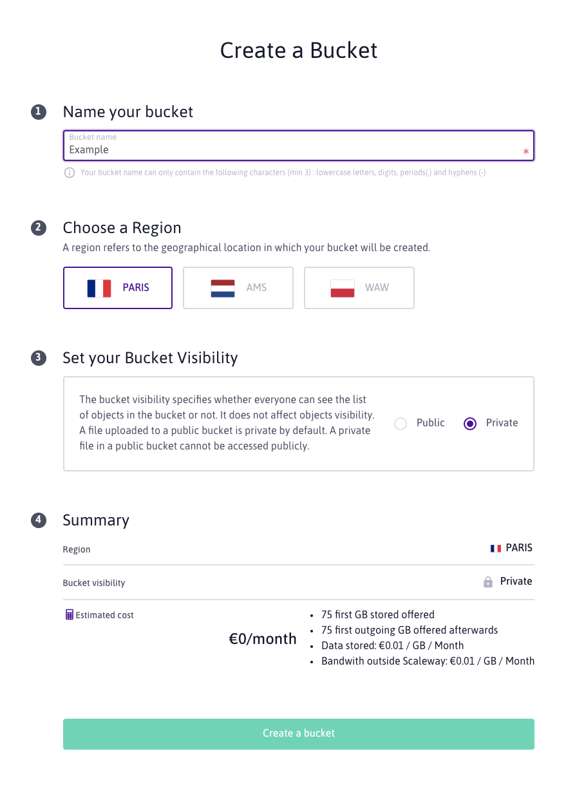

After creating your data storage, upload the zip-File you have downloaded earlier. This file contains our images and the metadata about each photo.

**Important note: Make your zip-File public! We need a publicly available link for later when we want to download the data.**

The next step on the list is the pipeline code. You can find it under "/pipeline/run_pipeline.py":

```python
import os
from glob import glob
from pathlib import Path
from random import sample
from itertools import chain

import numpy as np
import pandas as pd
from sklearn.model_selection import train_test_split

DIRECTORY_ROOT = os.path.abspath(Path(os.getcwd()))

def get_all_images():
    """Helper function to get the paths to all the images
    Returns:
        list: list of all image paths
    """
    all_image_paths = {os.path.basename(x): x for x in glob(
        os.path.join(DIRECTORY_ROOT + '/data', 'images*', '*.png'))}
    return all_image_paths

def prepare_dataset():
    """Helper function to get and prepare the dataset
        - Reduces the dataset to only the values for which we have images
        - Deletes not needed columnns
        - Adds a column for each finding
    Returns:
        pandas dataframe: prepared dataframe
    """
    df = pd.read_csv(DIRECTORY_ROOT + '/data/Data_Entry_2017.csv')
    df.columns = df.columns.str.replace(' ', '_')
    all_image_paths = get_all_images()
    image_paths = []

    for key in all_image_paths:
        image_paths.append(key)

    df = df[df['Image_Index'].isin(image_paths)]
    del df['View_Position']
    del df['OriginalImage[Width']
    del df['Height]']
    del df['OriginalImagePixelSpacing[x']
    del df['y]']
    del df['Unnamed:_11']
    all_labels = np.unique(
        list(chain(*df['Finding_Labels'].map(lambda x: x.split('|')).tolist())))
    all_labels = [x for x in all_labels if len(x) > 0]
    for c_label in all_labels:
        if len(c_label) > 1:  # leave out empty labels
            df[c_label] = df['Finding_Labels'].map(
                lambda finding: 1 if c_label in finding else 0)
    del df['Finding_Labels']

    # add a path column to the image
    df['path'] = df['Image_Index'].map(all_image_paths.get)

    return df

def create_splits(df, test_size, classToPredict):
    """Helper function to generate training and testing datasets
    Args:
        df (pandas dataframe): dataset from which the splits should be generated
        test_size (float): size of testing dataset
        classToPredict (string): name of the column in the dataset
    Returns:
        pandas dataframe: training and testing dataset
    """
    train_df, test_df = train_test_split(
        df,  test_size=test_size, stratify=df[classToPredict])

    print("Total Pneumonia cases: ", df['Pneumonia'].sum())
    print("train_df", train_df.shape)
    print("test_df", test_df.shape)

    # Check the distribution of Pneumonia cases in the test and validation set
    print("train distribution before",
          train_df['Pneumonia'].sum()/len(train_df))
    print("test distribution before", test_df['Pneumonia'].sum()/len(test_df))

    # Get a balanced dataset (50/50) = equal amount of positive and negative cases in Training
    # so our model has enough cases to learn from
    p_inds = train_df[train_df.Pneumonia == 1].index.tolist()
    np_inds = train_df[train_df.Pneumonia == 0].index.tolist()

    np_sample = sample(np_inds, len(p_inds))
    train_df = train_df.loc[p_inds + np_sample]
    print("train distribution after",
          train_df['Pneumonia'].sum()/len(train_df))

    return train_df, test_df

def start():
    """Get, prepare and split the dataframe into test and training sets and save it locally
    """
    df = prepare_dataset()
    train_df, test_df = create_splits(df, 0.2, 'Pneumonia')
    print("lenght train df", len(train_df))
    print("lenght test df", len(test_df))
    print("Pneumonia cases train df", train_df['Pneumonia'].sum())
    print("Pneumonia cases test df", test_df['Pneumonia'].sum())
    # save train and testing data to /data
    train_df.to_csv(DIRECTORY_ROOT + '/data/training_set.csv')
    test_df.to_csv(DIRECTORY_ROOT + '/data/testing_set.csv')

if __name__ == '__main__':
    start()
```

This script cleans and prepares the dataset, creates two CSV-files with our training and test splits, and saves them in our /data directory. The last thing we need is a server to run our code on.

In your terminal, just type:

```bash
scw instance server create type=DEV1-S image=89c80d27-ddf4-4ffa-8215-b335cce3fd05 root-volume=l:20G name=scw-example ip=new project-id=7ee9051f-09cd-46f8-8b91-00f8dc3149bb
```

This one line creates a DEV1-S instance with Docker already installed in the Paris region. That's it, and now we have our server. And we also have everything we need for our pipeline. So let's move on.

<br>

**Connecting to our server**

To execute our pipeline, we have to upload our python script and transfer our dataset. To do this, we have to connect to our server first. All we need is our SSH-Key and the IP-Address of the server.

```bash
ssh -i ~/.ssh/[path_to_your_private_ssh_key] root@[server_ip]
```

You can find the detailed documentation on how to connect to your instance here: [https://www.scaleway.com/en/docs/create-and-connect-to-your-server](https://www.scaleway.com/en/docs/create-and-connect-to-your-server)

The dataset is stored in our data storage. To get it, we need to install S3CMD. S3CMD is a free command-line tool and client for uploading, retrieving, and managing data in Amazon S3 and other cloud storage service providers (Scaleway uses S3 under the hood).

<br>

**Install and configure S3CMD on our server**

First we have to install it:

```bash
# install S3CMD
apt-get update && apt-get install S3CMD -y
```

Create the configuration file with:

```bash
# create file
touch .s3cfg
```

Edit the file:

```bash
# open the file in vim
vim .s3cfg
```

To enter the Inser-Mode in vim type `i`, then copy & paste the config:

```bash
[default]
# Object Storage Region fr-par
host_base = s3.fr-par.scw.cloud
host_bucket = %(bucket)s.s3.fr-par.scw.cloud
bucket_location = fr-par
use_https = True

# Login credentials
access_key = <Your_Scaleway_Access_Key>
secret_key = <Your_Scaleway_Secret_Key>
```

To save the file, quit the insert mode by clicking the escape-Button on your keyboard and then save & quit vim by typing `:wp`

<br>

You can find your access and secret key in your Scaleway console: [https://console.scaleway.com/project/credentials](https://console.scaleway.com/project/credentials)

If you want to know what else you can do with S3CMD, check out the docs: [https://www.scaleway.com/en/docs/object-storage-with-S3CMD/](https://www.scaleway.com/en/docs/object-storage-with-S3CMD/))

<br>

The next step is to copy the files from our GitHub repository to the server:

```bash
# Make sure you are in the root folder
pwd # /root

# download the repository into the app directory
git clone https://github.com/SaschaMet/E2E_ML_Scaleway.git app

# go to the new app directory
cd app
```

Now let's download the images from our data storage:

```bash
# download the zip file
wget https://[your_bucket_name].s3.fr-par.scw.cloud/Archive.zip

# move the file to the a new data /directory
mkdir data && mv Archive.zip data/Archive.zip

# unpack the zip file
# 1. download unzip
apt-get update && apt-get install unzip -y
# 2. unzip the file
cd data && unzip Archive.zip && cd ..
# 3. Optional: remove the __MACOSX folder
rm -rf data/__MACOSX
```

Almost there. The last step before we can run our pipeline ist to install the requirements and build the docker image:

```bash
# install only the requirements for the pipeline
mv ./pipeline/requirements-pipeline.txt requirements.txt

# build the docker image
docker build -t mlscwexample .
```

Finally, let's run the pipeline:

```bash
docker run --name mlscwexample --rm -v "$PWD":/app mlscwexample python pipeline/run_pipeline.py
```

The -v option tells Docker to sync the files from the container back to our disk. After the execution, you should see two new CSV-files in the "/data" directory.

<br>

Now we can upload our training and testing CSV-files to our data store:

```bash
S3CMD put File data/testing_set.csv s3://[your_bucket_name] --acl-public
S3CMD put File data/training_set.csv s3://[your_bucket_name] --acl-public
```

**Important note: The --acl-public is used to make your files publicly available. Please make sure the files are publicly available because we need to download them later!**

And we're done! We successfully executed our pipeline 🥳

Because there is no need anymore for our server, we can shut it down:

```bash
scw instance server stop [id_of_your_instance]
```

<br>
<br>

Quite a few steps for executing a simple python file, huh? The good thing is we do not have to do this every time we want to complete our pipeline. Most of the things we have done so far were to configure everything so our server can run the pipeline. The next time it will be much simpler. The only thing you have to do is to log into your server and type the following command:

```bash
chmod u+x run_pipeline.sh && ./run_pipeline.sh
```

This shell-script will:

- Fetch the current GitHub repository
- Build and run the docker image
- Upload the files to our data storage

Much better! Now to the fun part, creating and training our machine learning model!

<br>
<br>

## Creating a Pneumonia detector from chest x-rays

Most of the initial things we have to do will be the same as above:

1. We have to create a server
2. We have to configure S3CMD
3. We have to download the dataset and the GitHub repo
4. And finally, we have to build and run the Docker image

<br>

Create a GPU instance

```bash
scw instance server create type=RENDER-S zone=fr-par-1 image=ubuntu_bionic_ml_10.1 root-volume=l:400G name=scw-gpu ip=new project-id=7ee9051f-09cd-46f8-8b91-00f8dc3149bb
```

**Note:** You do not need to create a GPU instance. You can go with the same server as we used for our pipeline, too. But beware that the training process on a CPU will be much slower than on a GPU!

Log into the server

```bash
ssh -i ~/.ssh/[private_key] root@[instance_ip]
```

Install and configure S3CMD

```bash
# install S3CMD
apt-get update && apt-get install S3CMD -y
```

```bash
# create the configuration file
touch .s3cfg
```

```bash
# open the file in vim
vim .s3cfg
```

Paste the config:

```bash
[default]
# Object Storage Region fr-par
host_base = s3.fr-par.scw.cloud
host_bucket = %(bucket)s.s3.fr-par.scw.cloud
bucket_location = fr-par
use_https = True

# Login credentials
access_key = <Your_Scaleway_Access_Key>
secret_key = <Your_Scaleway_Secret_Key>
```

Download the repository:

```bash
# Make sure you are in the root folder
pwd # /root

# download the repository into the app directory
git clone https://github.com/SaschaMet/E2E_ML_Scaleway.git app

# go to the new app directory
cd app
```

Download the dataset:

```bash
# download the dataset and the train and test splits
wget http://scw-ml-example.s3.fr-par.scw.cloud/Archive.zip
wget http://scw-ml-example.s3.fr-par.scw.cloud/testing_set.csv
wget http://scw-ml-example.s3.fr-par.scw.cloud/training_set.csv

# move the file to the a new data /directory
mkdir data && mv Archive.zip data/Archive.zip && mv training_set.csv data/training_set.csv && mv testing_set.csv data/testing_set.csv

# unpack the zip file
# 1. download unzip
apt-get update && apt-get install unzip -y
# 2. unzip the file
cd data && unzip Archive.zip && cd ..
# 3. Optional: remove the __MACOSX folder
rm -rf data/__MACOSX
```

The heart of our application is the machine learning model. Here is the first piece, an image data generator function. This script will return a generator function, which itself returns a batch of images when called, and in the case of our training set, it will do a few image augmentations.

```python
# /model/data_generator.py
from keras.preprocessing.image import ImageDataGenerator

IMG_SIZE = (224, 224)
BATCH_SIZE = 64

def image_augmentation():
	"""Helper function to create ImageDataGenerator function

    Returns: image data generator function
    """
    idg = ImageDataGenerator(rescale=1 / 255.0,
                             horizontal_flip=True,
                             vertical_flip=False,
                             height_shift_range=0.1,
                             width_shift_range=0.1,
                             rotation_range=25,
                             shear_range=0.1,
                             zoom_range=0.15)
    return idg

def make_train_gen(df):
		"""Generate batches of tensor image data with real-time data augmentation.
    The data will be looped over (in batches).

    Args:
        df ([dataframe]): [dataframe of the training data]

    Returns:
        [generator function]: Generator function for training data
    """
    idg = image_augmentation()
    train_gen = idg.flow_from_dataframe(dataframe=df,
                                        directory=None,
                                        x_col='path',
                                        y_col='Pneumonia',
                                        class_mode='raw',
                                        target_size=IMG_SIZE,
                                        batch_size=BATCH_SIZE
                                        )
    return train_gen

def make_test_gen(valid_df):
		"""Generate batches of tensor image data with real-time data augmentation.
    The data will be looped over (in batches).

    Args:
        df ([dataframe]): [dataframe of the testing data]

    Returns:
        [generator function]: Generator function for testing data
    """
    test_idg = ImageDataGenerator(rescale=1. / 255.0)
    test_gen = test_idg.flow_from_dataframe(dataframe=valid_df,
                                            directory=None,
                                            x_col='path',
                                            y_col='Pneumonia',
                                            class_mode='raw',
                                            shuffle=False,
                                            target_size=IMG_SIZE,
                                            batch_size=BATCH_SIZE)
    return test_gen

def create_train_data(train_df):
    train_gen = make_train_gen(train_df)
    return train_gen

def create_test_data(test_df):
    train_gen = make_test_gen(test_df)
    return train_gen
```

And here is the code of our machine learning model. I use the pre-trained VGG16 model and only add a few Dense layers at the end. These layers will (hopefully) learn to detect Pneumonia in our x-rays.

```python
# /model/model.py

import os
from pathlib import Path

import pandas as pd
import tensorflow as tf
import matplotlib.pyplot as plt
from keras.optimizers import Adam
from keras.applications.vgg16 import VGG16
from keras.models import Sequential, Model
from keras.layers import Dense, Dropout, Flatten
from keras.callbacks import ModelCheckpoint, EarlyStopping

# pylint: disable=import-error
from . import data_generator

EPOCHS = 30
LEARNING_RATE = 1e-4
DIRECTORY_ROOT = os.path.abspath(Path(os.getcwd()))

def load_datasets():
		"""Helper function to get the training and testing dataset

    Returns:
        dataframe: Testing dataframe
        dataframe: Training dataframe
    """
    test_df = pd.read_csv(DIRECTORY_ROOT + '/data/testing_set.csv')
    train_df = pd.read_csv(DIRECTORY_ROOT + '/data/training_set.csv')
    return train_df, test_df

def save_history(history):
		"""Helper function to save a png image of the loss and accuracy

    Args:
        history ([tf history]): The history object of a tf model
    """
    f = plt.figure()
    f.set_figwidth(15)

    f.add_subplot(1, 2, 1)
    plt.plot(history.history['val_loss'], label='val loss')
    plt.plot(history.history['loss'], label='train loss')
    plt.legend()
    plt.title("Modell Loss")

    f.add_subplot(1, 2, 2)
    plt.plot(history.history['val_accuracy'], label='val accuracy')
    plt.plot(history.history['accuracy'], label='train accuracy')
    plt.legend()
    plt.title("Modell Accuracy")

    plt.savefig(DIRECTORY_ROOT + '/model/history.png')

def load_pretrained_model(layer_of_interest="block5_pool"):
		"""Helper function to load the VGG16 model

    Args:
        layer_of_interest (str optional): The transfer layer. Defaults to "block5_pool".

    Returns: VGG16 Model
    """
    model = VGG16(include_top=True, weights='imagenet')
    transfer_layer = model.get_layer(layer_of_interest)
    vgg_model = Model(inputs=model.input, outputs=transfer_layer.output)

		# do not re-train the first layers
    for layer in vgg_model.layers[0:17]:
        layer.trainable = False

    return vgg_model

def build_model():
		"""Function to build the ml model

    Returns: ML Model
    """
    model = Sequential()

    # add your pre-trained model,
    model.add(load_pretrained_model())

    # additional layers
    model.add(Flatten())
    model.add(Dropout(0.5))

    model.add(Dense(1024, activation='relu'))
    model.add(Dropout(0.3))

    model.add(Dense(512, activation='relu'))
    model.add(Dropout(0.3))

    model.add(Dense(256, activation='relu'))
    model.add(Dropout(0.3))

    model.add(Dense(1, activation='sigmoid'))
    return model

def train(model, train_df, test_df):
		"""Function to train the model

    Args:
        model: The model which should be trained
        train_df (dataframe): Training dataframe
        test_df (dataframe): Testing dataframe
    """
    epochs = EPOCHS
    optimizer = Adam(lr=LEARNING_RATE)
    loss = 'binary_crossentropy'
    metrics = ['accuracy']

    test_gen = data_generator.create_test_data(test_df)
    train_gen = data_generator.create_train_data(train_df)

    testX, testY = test_gen.next()

    model.compile(optimizer=optimizer, loss=loss, metrics=metrics)

    weight_path = DIRECTORY_ROOT + "/model/best.model.hdf5"

    checkpoint = ModelCheckpoint(weight_path,
                                 monitor='val_loss',
                                 verbose=1,
                                 save_best_only=True,
                                 mode='auto',
                                 save_weights_only=True)

    early = EarlyStopping(monitor='val_loss',
                          mode='auto',
                          patience=10)

    callbacks_list = [checkpoint, early]

    history = model.fit(train_gen,
                        validation_data=(testX, testY),
                        epochs=epochs,
                        callbacks=callbacks_list,
                        verbose=1)

    save_history(history)

    # save model architecture to a .json:
    model_json = model.to_json()
    with open(DIRECTORY_ROOT + "/model/my_model.json", "w") as json_file:
        json_file.write(model_json)

def start():
    train_df, test_df = load_datasets()
    model = build_model()
    # free up memory
    tf.keras.backend.clear_session()
    print("Model Summary", model.summary())
    train(model, train_df, test_df)

start()
```

<br>

Build the docker image

```bash
docker build -t mlscwexample .
```

Run the Docker image to train the model

```bash
docker run --name mlscwexample --rm -v "$PWD":/app mlscwexample python -m model.model.py
```

Upload the results to our data storage

```bash
S3CMD put File model/best.model.hdf5 s3://scw-ml-example --acl-public
S3CMD put File model/history.png s3://scw-ml-example --acl-public
S3CMD put File model/my_model.json s3://scw-ml-example --acl-public
```

Here we upload our model, our model weights, and a png-image with our training results.

**Important note: The --acl-public is used to make your files publicly available. Please make sure the files are publicly available because we need to download them later!**

Because the GPU is expensive and we do not need it anymore, we can shut it down:

```bash
scw instance server stop [id_of_your_instance]
```

And again, there's a shell-script to execute it all at once:

```bash
chmod u+x run_and_save_model_to_S3.sh && ./run_and_save_model_to_S3.sh
```

<br>
<br>

Let's do a quick recap. So far, we have a pipeline, an ML model to detect Pneumonia, and we have saved the model to our data storage. To make use of our model, we need (again) a server and some way to communicate with it. The easiest way is to create a REST-API with a simple flask server. This server will receive an image, make the classification, and return the result.

So let's do it (this will be the last server for today, I promise 🤞).

<br>
<br>

## Production Deployment

Here I will create the same type of server as for our pipeline. If you want to use this in production, you probably should use an instance with a bit more power like the GP1-S.

```bash
scw instance server create type=DEV1-S image=89c80d27-ddf4-4ffa-8215-b335cce3fd05 root-volume=l:20G name=scw-example-server ip=new project-id=7ee9051f-09cd-46f8-8b91-00f8dc3149bb
```

SSH into the server:

```bash
ssh -i ~/.ssh/[private_key] root@[instance_ip]
```

Download the GitHub repo:

```bash
# Make sure you are in the root folder
pwd # /root

# download the repository into the app directory
git clone https://github.com/SaschaMet/E2E_ML_Scaleway.git app

# go to the new app directory into the server module
cd app

# Because we only need a few requirements for our server we can use
# the requirements-server.txt file instead of our usual requirements.txt file
mv server/requirements-server.txt requirements-server.txt
```

Download the model:

```bash
wget https://scw-ml-example.s3.fr-par.scw.cloud/my_model.json &&
wget https://scw-ml-example.s3.fr-par.scw.cloud/best.model.hdf5
```

Build the docker image

```bash
docker build -t mlscwexample .
```

Start the flask server

```bash
docker run --name mlscwexample --rm -p 80:5000 -v "$PWD":/app mlscwexample python server/server.py
```

That's it. Know we can send requests to our server and get predictions:

```bash
curl --location --request POST '[Your_Server_IP]' \
--form 'file=@[path_to_a_x_ray_image]'
```

You can use tools like Postman, too. The response from the server should look like this:

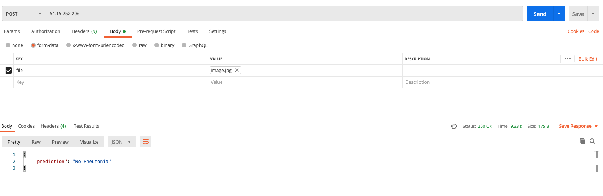

We've done it. We have a production server on which our model is running. To complete the ML Cycle, we still have to set up additional monitoring and evaluate our model against its classification. Because these steps depend strongly on the use case and your requirements, I will skip this step. But if you want to keep going, I recommend the ELK-Stack for your server monitoring ([https://www.elastic.co/log-monitoring](https://www.elastic.co/log-monitoring)), and here ist an excellent blog post from Nanonets about model evaluation: [https://nanonets.com/blog/machine-learning-production-retraining](https://nanonets.com/blog/machine-learning-production-retraining)

But we're not done now. If you want to change something in the codebase, you have to rerun everything. You have to start your instances, log into your servers, execute the shell-scripts, upload the data to your data store, and shut down every server afterward. I think we can do better.

<br>
<br>

## CI / CD with GitHub Actions

In most cases, you want to execute the whole ML Cycle when you have made changes to your code, e.g., improved your model or updated your pipeline. It would also be ideal if the process could run automatically when you create a Pull Request so you won't have to start it on your own.

Welcome to GitHub Actions! GitHub Actions allow us to define steps that will be executed automatically every time we create a pull request or merge a feature branch into our main branch.

Here is the code for our action:

```yaml
# .github/workflows/run_pipeline.yml

name: CI

# Execute the action on pull request to the main branch
on:
  pull_request:
    branches: [ main ]

jobs:
  build:
	runs-on: ubuntu-latest
    steps:

    # Install and set the SSH Keys we need to login into our instances
    - name: Install SSH key
      uses: shimataro/ssh-key-action@v2
      with:
        key: ${{ secrets.SSH_KEY }}
        name: scaleway
        known_hosts: ${{ secrets.KNOWN_HOSTS }}

    # Pipeline
    - name: Start Scaleway CPU Server
      uses: jawher/action-scw@v2.0.0-2
      env:
        SCW_ACCESS_KEY: ${{ secrets.SCW_ACCESS_KEY }}
        SCW_SECRET_KEY: ${{ secrets.SCW_SECRET_KEY }}
        SCW_ORGANIZATION_ID: ${{ secrets.SCW_ORGANIZATION_ID }}
        SCW_ZONE: fr-par-1
      with:
        args: instance server start -w ${{ secrets.SERVER_ID_CPU }}

	# When trying to connect to the server directly after it has started sometimes there is an error
    - name: Sleep for 30 seconds
      uses: jakejarvis/wait-action@master
      with:
        time: '30s'

    - name: Run Pipeline
      run: |
        echo "SSH into server"
        # chmod u+x run_pipeline_ci.sh
        ssh -i ~/.ssh/scaleway -t ${{ secrets.USER_SERVER_CPU }} << EOF
          echo "Switching the path to /app"
          cd app
          echo "Run the pipeline"
          chmod u+x run_pipeline.sh && ./run_pipeline.sh
          echo "Done"
        EOF

    - name: Stop Scaleway CPU Server
      uses: jawher/action-scw@v2.0.0-2
      env:
        SCW_ACCESS_KEY: ${{ secrets.SCW_ACCESS_KEY }}
        SCW_SECRET_KEY: ${{ secrets.SCW_SECRET_KEY }}
        SCW_ORGANIZATION_ID: ${{ secrets.SCW_ORGANIZATION_ID }}
        SCW_ZONE: fr-par-1
      with:
        args: instance server stop ${{ secrets.SERVER_ID_CPU }}

    # Model
    - name: Start Scaleway GPU Server
      uses: jawher/action-scw@v2.0.0-2
      env:
        SCW_ACCESS_KEY: ${{ secrets.SCW_ACCESS_KEY }}
        SCW_SECRET_KEY: ${{ secrets.SCW_SECRET_KEY }}
        SCW_ORGANIZATION_ID: ${{ secrets.SCW_ORGANIZATION_ID }}
        SCW_ZONE: fr-par-1
      with:
        args: instance server start -w ${{ secrets.SERVER_ID_GPU }}

	# When trying to connect to the server directly after it has started sometimes there is an error
    - name: Sleep for 30 seconds
      uses: jakejarvis/wait-action@master
      with:
        time: '30s'

    - name: Train Model
      run: |
        echo "SSH into server"
        # chmod u+x run_pipeline_ci.sh
        ssh -i ~/.ssh/scaleway -t ${{ secrets.USER_SERVER_GPU }}  << EOF
          echo "Switching the path to /app"
          cd app
          echo "Run the model"
          chmod u+x run_and_save_model_to_S3.sh && ./run_and_save_model_to_S3.sh
          echo "Done"
        EOF

    - name: Stop Scaleway GPU Server
      uses: jawher/action-scw@v2.0.0-2
      env:
        SCW_ACCESS_KEY: ${{ secrets.SCW_ACCESS_KEY }}
        SCW_SECRET_KEY: ${{ secrets.SCW_SECRET_KEY }}
        SCW_ORGANIZATION_ID: ${{ secrets.SCW_ORGANIZATION_ID }}
        SCW_ZONE: fr-par-1
      with:
        args: instance server stop ${{ secrets.SERVER_ID_GPU }}
```

This action does the same thing we would do, from starting the server, executing scripts, and shutting everything down again. Except it does it automatically.

You can also see that we use a couple of secrets so our action can do its job. These secrets are, for example, the access keys for Scaleway or our server IP-addresses. You can add secrets to your repository under Settings → Secrets. Here are the secrets we need:

<br>

**Github Secrets:**

- SSH_KEY<br>
A private SSH-Key for connecting to your Scaleway account
- KNOWN_HOSTS<br>
The known_hosts file from your computer. This file contains the known keys for remote hosts. You can read more about it here: [https://en.wikibooks.org/wiki/OpenSSH/Client_Configuration_Files#~/.ssh/known_hosts](https://en.wikibooks.org/wiki/OpenSSH/Client_Configuration_Files#~/.ssh/known_hosts)
- SCW_ACCESS_KEY<br>
Your Scaleway access key
- SCW_SECRET_KEY<br>
Your Scaleway secret key
- SCW_ORGANIZATION_ID<br>
Your Scaleway organization id
- SERVER_ID_CPU<br>
The server ID of your cpu instance
- SERVER_ID_GPU<br>
The server ID of your gpu instance
- USER_SERVER_CPU<br>
The user of your cpu instance (normally root@[cpu_instance_ip])
- USER_SERVER_GPU<br>
The server ID of your gpu instance (normally root@[gpu_instance_ip])

<br>

After creating the file for your GitHub Action and adding your secrets, you can make a new pull request, and your workflow should start:

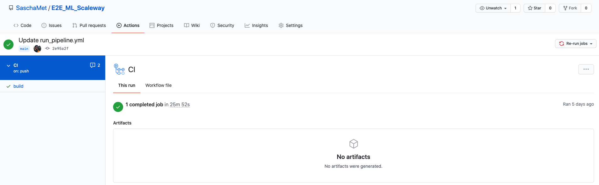

<br>

You can adapt the workflow as you wish. Also, there are many ways to improve our current workflow:

For example, you could create a second GitHub Action, which will be executed after you have merged a pull request into your master branch to reboot your production server after fetching the new model from your data store.

Another idea is to skip building docker images whenever we want to run the pipeline or train the model. You can upload the images to Dockerhub and tell your GitHub Action to login into your Dockerhub account and download the image from there. If I would work on a bigger project, this is definitely a thing I would want to have. And because we use instances with Docker already installed, it is no problem to do this.

<br>
<br>

## Things to improve
<br>

Besides CI / CD pipelines, there are also a couple of other things we could do to improve the project in general:

- **Continuous Machine Learning (CML)**<br>
Comparing ML experiments across your project history and monitoring changing datasets has never been easier. With CML, you can include metrics from your updated model directly in your pull requests and compare them with your current model: 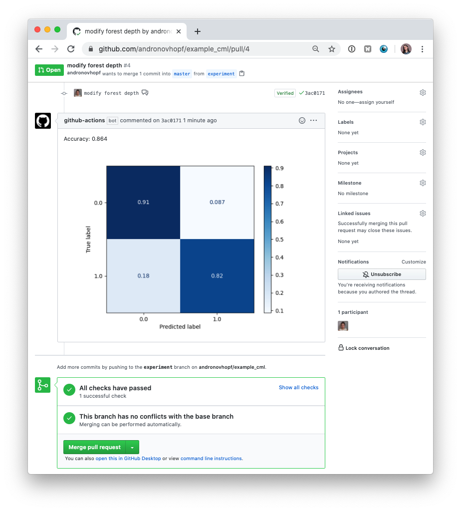
    Source: [https://github.com/iterative/cml/blob/master](https://github.com/iterative/cml/blob/master/imgs/cml_first_report.png)

- **Data Version Control (DVC)**<br>
Have you ever heard of DVC ([https://dvc.org](https://dvc.org/))? DVC is an excellent tool for every data scientist. It is git for your datasets. Instead of downloading your zip-files or images manually, type `dvc pull`, and it will download your data. It also tracks changes in your datasets.

- **Data Streams**<br>
Instead of downloading your data, you can also work with streams. Downloading 1 GB is no problem, but what about 50 GB? Or 100 GB? Or a Terabyte? This would take forever. With data streams, you don't have to download the whole dataset to begin training your model. Instead, the model training starts when the data stream begins. If you want to dive deeper, [here is a great blog post](https://medium.com/analytics-vidhya/data-streams-and-online-machine-learning-in-python-a382e9e8d06a) which explains this concept in-depth.

- **Kubernetes**<br>
Sometimes we have so much data that one GPU is not enough and training our model would take ages. In this case you would have to use multiple GPUs and distribute your model training. With Kubernetes it is easy to scale up your instances and mange your training. [Sacleway supports Kubernetes](https://www.scaleway.com/en/kubernetes-kapsule/) and you can use [Kubeflow's Tensorflow job operator](https://www.kubeflow.org/docs/components/training/tftraining/) to handle distributed TensorFlow training jobs.

- **Model optimization**<br>
We might have a good infrastructure but this helps no one if our model is useless. We didn't focus on model optimization in this blog post but there is much we can do to improve it. For example, you can use [more data](https://www.kaggle.com/nih-chest-xrays/data),  look into [Hyperparameter tuning](https://blog.tensorflow.org/2020/01/hyperparameter-tuning-with-keras-tuner.html) or learn more about [machine learning in the healthcare sector](https://www.coursera.org/learn/fundamental-machine-learning-healthcare).

- **Server Monitoring or Serverless Functions**<br>
At the moment, we do not have a monitoring system for our server. We would not notice if an error occurs or something breaks. As already mentioned above, a good monitoring system is key and one of my favorites is this one: [https://www.elastic.co/log-monitoring](https://www.elastic.co/log-monitoring).
<br>
An alternative to our server is a so-called serverless function.
These functions are hosted on managed infrastructure, which means you do not have to manage them yourself. Your cloud service provider does that! You give them a function you want to execute, and they create and host the infrastructure your code can run on. You also only pay for every function call, not for a whole server. That would be great in our case because our flask-server executes only one function, not more, and instead of running an expensive server for this one piece of code, we could use serverless functions. And [Scaleway supports serverless functions](https://www.scaleway.com/en/betas/#serverless), too.

<br>

As you can see, there are many things we could do. If you are interested in one of these topics, let me know, and I write more about it :)

For now, let's call it a day. I hope you have learned a lot, and I wish you luck on your machine learning journey!